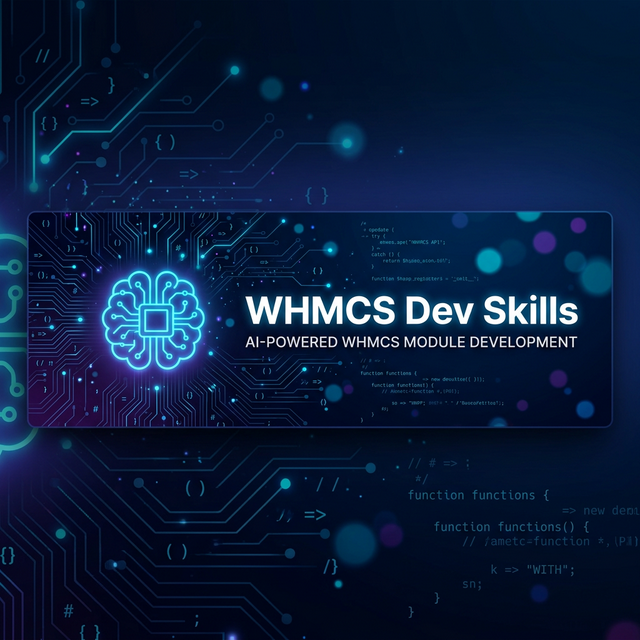

<p align="center">
  
</p>

<h1 align="center">WHMCS Dev Skills</h1>

<p align="center">
  <strong>The definitive AI agent skill for WHMCS module development</strong>
</p>

<p align="center">
  <a href="#-quick-install"></a>
  <a href="#-compatible-agents"></a>
  <a href="#-whats-inside"></a>
  <a href="LICENSE"></a>
</p>

<p align="center">
  <a href="#-quick-install">Quick Install</a> · <a href="#-whats-inside">What's Inside</a> · <a href="#-compatible-agents">Compatible Agents</a> · <a href="#%EF%B8%8F-ide-setup">IDE Setup</a> · <a href="#-contributing">Contributing</a>
</p>

---

## 🧠 What Is This?

This repository contains **[`SKILL.md`](SKILL.md)** — a comprehensive instruction set designed for AI coding agents. When loaded, it transforms any AI into a **Senior WHMCS Developer & Architect** that writes **production-ready, secure, and maintainable** code following WHMCS 8.x / 9.x best practices.

> Think of it as a "brain transplant" for your AI assistant — giving it deep expertise in WHMCS development that goes far beyond what's available in general training data.

```
Just one file: SKILL.md
```

Built on the [Agent Skills Specification](https://agentskills.io/specification) — the universal open standard for AI agent skills.

---

## ⚡ Quick Install

### One Command

```bash
npx ai-agent-skills install whmcs-dev-skills
```

That's it. The skill installs to the right location for your AI agent automatically.

### Install for a Specific Agent

```bash
npx ai-agent-skills install whmcs-dev-skills              # Claude Code (default)
npx ai-agent-skills install whmcs-dev-skills --agent cursor    # Cursor IDE
npx ai-agent-skills install whmcs-dev-skills --agent vscode    # GitHub Copilot
npx ai-agent-skills install whmcs-dev-skills --agent windsurf  # Windsurf
npx ai-agent-skills install whmcs-dev-skills --agent amp       # Amp
npx ai-agent-skills install whmcs-dev-skills --agent goose     # Goose
npx ai-agent-skills install whmcs-dev-skills --agent opencode  # OpenCode
npx ai-agent-skills install whmcs-dev-skills --agent project   # Any project
```

### Manual Install

```bash
git clone https://github.com/TheRabbiRifat/whmcs-skills.git
# Then copy SKILL.md to your agent's skills directory (see IDE Setup below)
```

---

## ✨ What's Inside

### Core Skill (`SKILL.md`)

The brain of the operation — a 1600+ line comprehensive instruction set covering:

| Category | Details |
|:---------|:--------|
| 🔧 **Module Types** | Addon, Provisioning, Registrar, Payment Gateway, Mail Provider, Notification Provider |
| 🗄️ **Database** | Capsule ORM, schema creation, migrations, transactions, pagination, batch ops |
| 🔌 **API** | `localAPI()` integration, GuzzleHTTP external calls, webhook handling |
| 🎨 **Templating** | Smarty v4, CSRF protection, output escaping, admin/client area UI |
| 🔒 **Security** | 13-point checklist, input validation, credential encryption, XSS/CSRF prevention |
| ⚠️ **Anti-Patterns** | 18+ documented pitfalls with correct solutions |
| 🐛 **Debugging** | Quick diagnosis table, debugging tools, PHP 8.x error fixes |
| 📁 **Structure** | Project templates for every module type |

### Supplementary Resources

| Directory | Contents | Files |
|:----------|:---------|:------|
| [`docs/`](docs/) | Architecture, patterns, examples, setup guides | 10 |
| [`guides/`](guides/) | Best practices, cheatsheet, troubleshooting, AI integration | 7 |
| [`references/`](references/) | JSON reference data (API, Hooks, Modules) | 12 |
| [`samples/`](samples/) | Real PHP code examples across 12 categories | 765+ |

> **Note:** `SKILL.md` is **fully self-contained**. The supplementary directories provide deeper reference material but are **not required** for the skill to work.

---

## 🛡️ Key Highlights

<table>
<tr>
<td width="50%">

### 🔒 Security-First
- Forces Capsule ORM
- CSRF protection built-in
- Credential scrubbing
- Input validation patterns

</td>
<td width="50%">

### 🆕 WHMCS 9.x Ready
- Smarty v4 compliance
- Illuminate v9 updates
- PHP 8.2+ compatibility
- Breaking change awareness

</td>
</tr>
<tr>
<td>

### 📋 Production-Ready
- Battle-tested templates
- Complete module scaffolds
- Full error handling
- Logging best practices

</td>
<td>

### ⚡ AI-Optimized
- Operational boundaries (ALWAYS/NEVER)
- Anti-pattern protection
- Context-efficient structure
- Works with 8+ AI agents

</td>
</tr>
</table>

---

## 🤖 Compatible Agents

| Agent | Skills Directory | Install Flag |
|:------|:-----------------|:-------------|
| [Claude Code](https://claude.ai) | `~/.claude/skills/` | `--agent claude` |
| [GitHub Copilot](https://github.com/features/copilot) | `.github/skills/` | `--agent vscode` |
| [Cursor IDE](https://cursor.sh) | `.cursor/skills/` | `--agent cursor` |
| [Windsurf](https://codeium.com/windsurf) | `.windsurf/skills/` | `--agent windsurf` |
| [Gemini](https://deepmind.google) | `.gemini/skills/` | — |
| [Amp](https://amp.dev) | `~/.amp/skills/` | `--agent amp` |
| [Goose](https://github.com/block/goose) | `~/.config/goose/skills/` | `--agent goose` |
| [OpenCode](https://opencode.ai) | `~/.opencode/skills/` | `--agent opencode` |

---

## 🛠️ IDE Setup

<details>
<summary><strong>Claude Code</strong></summary>

```bash
# Option 1: npx (recommended)
npx ai-agent-skills install whmcs-dev-skills

# Option 2: Manual
mkdir -p ~/.claude/skills/whmcs-dev-skills
cp SKILL.md ~/.claude/skills/whmcs-dev-skills/
```

The skill is automatically available in all Claude Code sessions.

</details>

<details>
<summary><strong>GitHub Copilot (VS Code)</strong></summary>

```bash
# Option 1: npx
npx ai-agent-skills install whmcs-dev-skills --agent vscode

# Option 2: As a skill file
mkdir -p .github/skills/whmcs-dev-skills
cp SKILL.md .github/skills/whmcs-dev-skills/

# Option 3: As copilot instructions
cp SKILL.md .github/copilot-instructions.md
```

> After adding the file, Copilot will automatically apply these instructions to all suggestions.

</details>

<details>
<summary><strong>Cursor IDE</strong></summary>

```bash
# Option 1: npx
npx ai-agent-skills install whmcs-dev-skills --agent cursor

# Option 2: Project-level (recommended)
mkdir -p .cursor/skills/whmcs-dev-skills
cp SKILL.md .cursor/skills/whmcs-dev-skills/

# Option 3: Global
mkdir -p ~/.cursor/skills/whmcs-dev-skills
cp SKILL.md ~/.cursor/skills/whmcs-dev-skills/

# Option 4: As Cursor Rule
mkdir -p .cursor/rules
cp SKILL.md .cursor/rules/whmcs-dev-skills.mdc
```

> You can also import via `Cursor Settings → Rules, Commands → Add Rule → Remote Rule (GitHub)`.

</details>

<details>
<summary><strong>Windsurf (Codeium)</strong></summary>

```bash
# Option 1: npx
npx ai-agent-skills install whmcs-dev-skills --agent windsurf

# Option 2: Project-level
mkdir -p .windsurf/rules
cp SKILL.md .windsurf/rules/whmcs-dev-skills.md

# Option 3: As project rules
cp SKILL.md .windsurfrules

# Option 4: Global rules
cat SKILL.md >> ~/.codeium/windsurf/memories/global_rules.md
```

</details>

<details>
<summary><strong>Gemini (Google AI)</strong></summary>

```bash
# Project-level skill
mkdir -p .gemini/skills/whmcs-dev-skills
cp SKILL.md .gemini/skills/whmcs-dev-skills/

# Or as agent instructions
mkdir -p .agent/skills
cp SKILL.md .agent/skills/whmcs-dev-skills.md
```

</details>

<details>
<summary><strong>Amp / Goose / OpenCode / Other</strong></summary>

```bash
# Amp
mkdir -p ~/.amp/skills/whmcs-dev-skills
cp SKILL.md ~/.amp/skills/whmcs-dev-skills/

# Goose
mkdir -p ~/.config/goose/skills/whmcs-dev-skills
cp SKILL.md ~/.config/goose/skills/whmcs-dev-skills/

# OpenCode
mkdir -p ~/.opencode/skills/whmcs-dev-skills
cp SKILL.md ~/.opencode/skills/whmcs-dev-skills/

# Any agent (generic)
mkdir -p .skills/whmcs-dev-skills
cp SKILL.md .skills/whmcs-dev-skills/
```

</details>

---

## 📁 Repository Structure

```
whmcs-dev-skills/
├── SKILL.md              ← The comprehensive AI agent skill (1600+ lines)
├── README.md             ← This file
├── LICENSE               ← GPL-2.0 License
├── banner.png            ← Repository banner
│
├── docs/                 ← Architecture, patterns, examples, setup
│   ├── architecture/
│   ├── examples/
│   ├── patterns/
│   ├── reference/
│   └── setup/
│
├── guides/               ← Best practices, cheatsheet, troubleshooting
│   ├── BEST-PRACTICES.md
│   ├── CHEATSHEET.md
│   ├── EXAMPLES-AND-PROMPTS.md
│   ├── AI-INTEGRATION.md
│   ├── QUICK-START.md
│   └── troubleshooting.md
│
├── references/           ← JSON reference data (12 files)
│   ├── api.json
│   ├── hooks.json
│   ├── addon_modules.json
│   ├── provisioning_modules.json
│   ├── registrar_modules.json
│   ├── payment_gateways.json
│   ├── themes.json
│   └── ...
│
└── samples/              ← 765+ PHP code examples
    ├── addon/
    ├── api/              (334 files)
    ├── hooks/            (339 files)
    ├── advanced/
    ├── gateways/
    ├── registrar/
    ├── themes/
    └── ...
```

---

## 🔬 Research & Sources

Built from deep research of:

- ✅ [WHMCS Official Developer Docs](https://developers.whmcs.com/) — every module type
- ✅ [WHMCS GitHub Samples](https://github.com/WHMCS) — all 5 official repos
- ✅ WHMCS 8.x → 9.x breaking changes — Smarty v4, Illuminate v9, PHP 8.2+
- ✅ [WHMCS Community Forums](https://whmcs.community/) — common developer pitfalls
- ✅ Real-world security best practices and anti-patterns
- ✅ [Agent Skills Specification](https://agentskills.io/specification) — universal skill format

---

## ❓ FAQ

<details>
<summary><strong>Does this work with my AI agent?</strong></summary>

Yes. This skill follows the [Agent Skills Specification](https://agentskills.io), supported by Claude Code, GitHub Copilot, Cursor, Windsurf, Gemini, Amp, Goose, OpenCode, and any agent that reads `SKILL.md` files.

</details>

<details>
<summary><strong>Do I need Node.js?</strong></summary>

Only for the `npx` install method. You can also manually copy `SKILL.md` to the appropriate directory.

</details>

<details>
<summary><strong>Will this modify my WHMCS installation?</strong></summary>

No. This skill file only provides instructions to your AI coding agent. It doesn't touch your WHMCS installation, database, or configuration.

</details>

<details>
<summary><strong>Does it support WHMCS 9.x?</strong></summary>

Yes. Includes specific guidance for WHMCS 9.x breaking changes including Smarty v4, Illuminate v9, and PHP 8.2+ requirements.

</details>

<details>
<summary><strong>Why not just use the WHMCS developer docs?</strong></summary>

This skill is specifically formatted for AI agents — it includes operational boundaries (ALWAYS/NEVER rules), anti-pattern protection, security checklists, and production-ready code templates that documentation alone doesn't provide.

</details>

---

## 🤝 Contributing

Contributions are welcome! Whether it's fixing a typo, adding a new hook point, or documenting another anti-pattern:

1. Fork this repository
2. Create a feature branch: `git checkout -b feature/awesome-improvement`
3. Make your changes
4. Commit: `git commit -m "feat: add awesome improvement"`
5. Push: `git push origin feature/awesome-improvement`
6. Open a Pull Request

### Ideas for Contributions

- 📝 Document more WHMCS 9.x breaking changes
- 🪝 Add hook point examples
- 🔒 Expand security best practices
- 🐛 Document common bugs and fixes
- 🌍 Add non-English language file examples
- 💻 Add provisioning module samples

---

## ⭐ Support

If this skill saved you time building WHMCS modules, please give it a **⭐** on GitHub!

---

## 📄 License

This project is licensed under the [GNU GPL v2.0](LICENSE).

---

<p align="center">
  <a href="https://therabbirifat.com">🌐 therabbirifat.com</a> · <a href="https://github.com/TheRabbiRifat">🐙 @TheRabbiRifat</a>
</p>

<p align="center">
  Built with ❤️ for the WHMCS developer community
</p>
